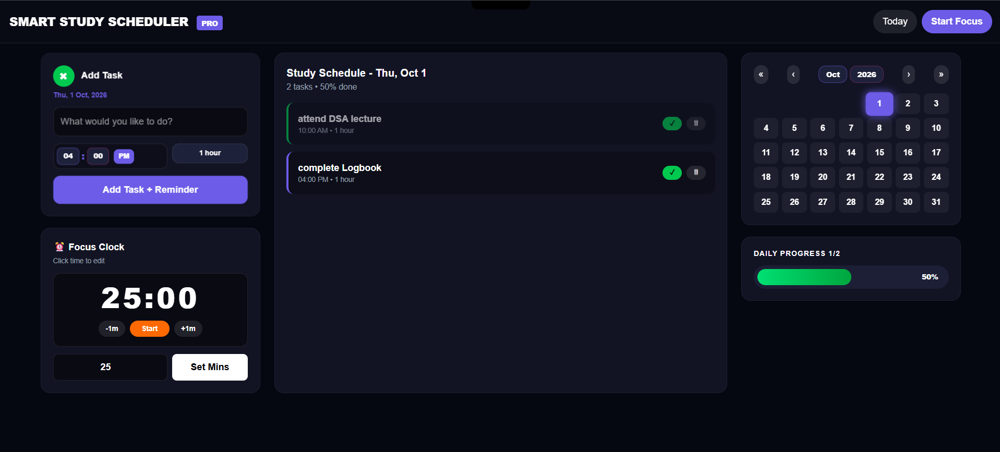

# Smart Study Scheduler - 3D 📅✨

## 📸 Dashboard Preview

> My 3D Study Scheduler with calendar - Plan your studies smartly, visually, and efficiently.

A modern, 3D-enabled study scheduler with calendar integration to help students organize subjects, set deadlines, and track progress visually. No more messy to-do lists.

### 🚀 Live Demo
**👉 [https://smart-study-scheduler-rho.vercel.app](https://smart-study-scheduler-rho.vercel.app)**

### ✨ Key Features
- 📅 **Calendar Integration** - Visual calendar view for all study tasks and deadlines
- 🎨 **3D Interactive UI** - Modern, engaging 3D design built with Three.js / React Three Fiber
- ✅ **Smart Task Management** - Add, edit, delete, and mark tasks as complete
- ⏰ **Priority & Scheduling** - Set dates, time, and priority for each subject
- 📊 **Progress Tracking** - Track your daily, weekly, and monthly study progress
- 📱 **Fully Responsive** - Works perfectly on mobile, tablet, and desktop

### 🛠️ Tech Stack
- **Frontend:** TypeScript (88.9%), JavaScript, CSS, React
- **Backend:** Python (7%) - REST API & Date Field Handling
- **Deployment:** Vercel
- **Architecture:** Monorepo - `frontend/` + `backend/`

### 📂 Project Structure
